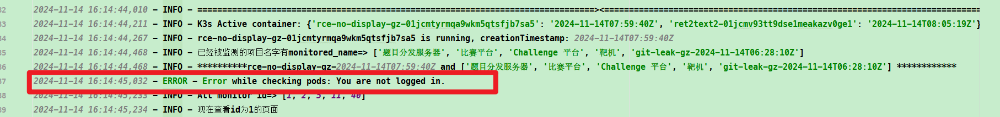

# uptime-kuma-auto-monitor-k3s
可自动监测正在运行的k3s容器 （主要用于使用Docker + k3s 方式部署的GZCTF平台的靶机状态监测）


`ca.crt`、`cert.crt`、`key.key`分别是` /etc/rancher/k3s/k3s.yaml`配置文件中的`certificate-authority-data`、`client-certificate-data`和`client-key-data`

(进行base64解码)
```yaml
apiVersion: v1
clusters:
- cluster:
    certificate-authority-data: <Base64 code>
    server: https://127.0.0.1:6443
  name: default
contexts:
- context:
    cluster: default
    user: default
  name: default
current-context: default
kind: Config
preferences: {}
users:
- name: default
  user:
    client-certificate-data: <Base64 code>
    client-key-data: <Base64 code>
```
## Usage
```bash
pip install -r requestment.txt
python3 uptime.py
```
运行日志

uptime-界面


## Update
第一次测试大约运行了210分钟,提示已经退出登陆了，应该是token过期了



```python
async def login():
    """重新登录函数"""
    try:
        api.login(username, password)
        logging.info("Successfully logged in.")
    except Exception as e:
        logging.error(f"Login failed: {e}")
```
增加了一个判断，如果登陆失效就重新登陆
效果如下图


### 依赖
[uptime-kuma-api](https://uptime-kuma-api.readthedocs.io/en/latest/)
